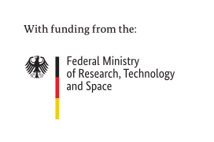

# Website for KompAKI EP 3 and EP 4

This is the [KompAKI](https://kompaki.de/) EP 3 and EP 4 public web page.

This repo is based on [Web pages for the 'Advances in Probabilistic Machine Learning Seminar'](https://github.com/AaltoML/apml/tree/286d2223c46a7353f3e9273c6d20d060aa6ad5a0) by Martin Trapp and Arno Solin.

This web page uses Jekyll through GitHub pages which renders static HTML pages that are accessible at [https://aaltoml.github.io/apml/](https://aaltoml.github.io/apml/). The layout should auto-support various screen sizes etc. through bootstrap. 

## Maintaining / Updating

All content is decoupled from the HTML/layout and should be edited in `_config.yml` and `_data/talks.yml`. Speaker photos should go in `assets/speakers/` if available.

## Previewing / Running locally

You will need to install Jekyll on your machine first or alternatively use the [devcontainer](https://containers.dev/) (which is easiest with [VSCode](https://code.visualstudio.com/)). After that, you can clone this repository, checkout the `main` branch, and run the following:

```shell
jekyll serve --baseurl ""
```

Where the `--baseurl` option overwrites the GitHub-specific path and makes the page preview available at (usually) [http://127.0.0.1:4000](http://127.0.0.1:4000).

## Acknowledgements

This research and development project was partially funded by the German Federal Ministry of Research, Technology and Space (BMFTR) within the “The Future of Value Creation – Research on Production, Services and Work” program (funding number 02L19C150). The respective authors are responsible for the content.



## License

See [LICENSE](LICENSE) for details.
